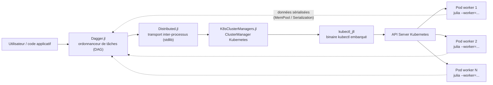

# Julia sur Kubernetes - K8sClusterManagers.jl × Dagger.jl

| **Documentation** | **Build Status** |
|:-----------------:|:----------------:|
| [](https://deep75.github.io/julia-k8s-dagger/) | [](https://github.com/deep75/julia-k8s-dagger/actions/workflows/Documentation.yml) [](https://deep75.github.io/julia-k8s-dagger/) |

Documentation technique détaillée, en **cadre théorique**, expliquant comment faire fonctionner
Julia dans un cluster Kubernetes à l'aide de :

- [K8sClusterManagers.jl](https://github.com/beacon-biosignals/K8sClusterManagers.jl) - un `ClusterManager` Julia qui provisionne des **pods workers** Kubernetes ;
- [Dagger.jl](https://github.com/JuliaParallel/Dagger.jl) - un **ordonnanceur de tâches** orienté DAG qui répartit le travail sur les workers Distributed (et au-delà : threads, GPU, MPI).

> **Note de cadrage** - Ce dépôt est une documentation de référence, pas un produit clé en main :
> les mécanismes décrits sont vérifiés dans les sources des paquets (versions citées plus bas),
> mais aucun déploiement n'est exécuté ici. Tous les diagrammes sont des blocs
> [mermaid.js](https://mermaid.js.org), rendus nativement par GitHub.

📖 **Documentation en ligne :** <https://deep75.github.io/julia-k8s-dagger/>

---

## Vue d'ensemble



**Lecture du schéma** : l'utilisateur écrit des tâches `Dagger.@spawn` ; Dagger les répartit sur
les processus connus de `Distributed` ; `K8sClusterManagers.jl` fournit ces processus en créant
des pods Kubernetes via `kubectl` ; les données circulent par sérialisation Julia entre pods.

## Table des matières

| Chapitre | Contenu |
|---|---|
| [01 - Introduction](docs/src/01-introduction.md) | Problématique, trois briques logicielles, glossaire |
| [02 - Architecture](docs/src/02-architecture.md) | Vue en couches, protocole `ClusterManager`, hiérarchie des processeurs, cycle de vie des pods, flux de données |
| [03 - K8sClusterManagers.jl](docs/src/03-k8sclustermanagers.md) | API complète, mécanismes internes, RBAC requise, hook `configure` |
| [04 - Dagger.jl](docs/src/04-dagger.md) | `@spawn`, options, processeurs, scopes, tolérance aux pannes, pools dynamiques |
| [05 - Intégration](docs/src/05-integration.md) | Le contrat entre les deux paquets, flux de bout en bout, environnement des workers, scénarios de panne |
| [06 - Déploiement](docs/src/06-deploiement.md) | Dockerfile, RBAC, manifest du driver, minikube, cas hors-cluster |
| [07 - Production](docs/src/07-production.md) | Monitoring, diagnostic, ressources, nettoyage, sécurité, performance |
| [08 - Limites et alternatives](docs/src/08-limites-et-alternatives.md) | Limites de la pile, arbres de décision, écosystème |

## Démarrage rapide (théorique)

1. **Image** : une image Docker contenant Julia + l'environnement projet pré-instancié
   ([chapitre 06](docs/src/06-deploiement.md)).
2. **Driver** : un pod (ou votre poste, via `kubeconfig`) exécutant :

   ```julia
   using Distributed, K8sClusterManagers, Dagger
   addprocs(K8sClusterManager(4; cpu="2", memory="8Gi"); exeflags=`--project=/app -t 2`)
   @everywhere using MonPackage
   résultat = fetch(Dagger.@spawn MonPackage.calcul_lourd(données))
   ```

3. **Nettoyage** : `rmprocs(workers())` arrête les workers ; les pods passent en `Completed`
   et se suppriment par label (`kubectl delete pod -l worker-prefix=...`,
   [chapitre 07](docs/src/07-production.md)).

## Versions de référence

| Composant | Version documentée | Contrainte Julia |
|---|---|---|
| K8sClusterManagers.jl | `0.1.5` | ≥ 1.6 |
| Dagger.jl | `0.22.x` (master) | ≥ 1.10 |
| kubectl (via `kubectl_jll`) | 1.20 | - |

> Pour utiliser les **deux** paquets ensemble : Julia **≥ 1.10**.

## Rendu des diagrammes

Les figures utilisent la syntaxe mermaid (` ```mermaid `). Elles se rendent :

- sur le site Documenter (via `DocumenterMermaid.jl`) — voir le lien en haut ;
- nativement sur GitHub / GitLab (vues fichier et README) ;
- dans VS Code (extension *Markdown Preview Mermaid Support*) ;
- en CLI : `mmdc -i docs/src/02-architecture.md -o out.svg` (*mermaid-cli*).

## Construire la documentation localement

```bash
julia --project=docs -e 'using Pkg; Pkg.instantiate()'
julia --project=docs docs/make.jl
# → ouvrir docs/build/index.html
```

Le déploiement sur GitHub Pages est automatisé par
[`.github/workflows/Documentation.yml`](.github/workflows/Documentation.yml)
(branche `gh-pages`). Activer une fois : *Settings → Pages → Source =
« Deploy from a branch » → `gh-pages` / `root`*.
