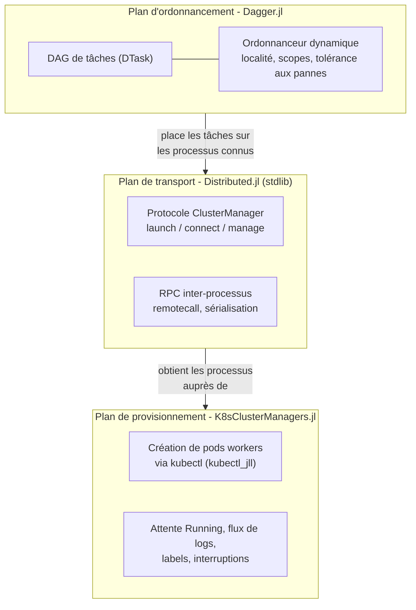
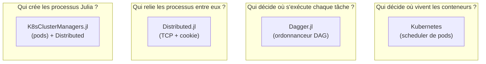

# 01 - Introduction

## 1.1 Objectif

Expliquer, pièce par pièce, comment faire exécuter des **calculs Julia distribués** dans un
cluster **Kubernetes** en combinant :

- `K8sClusterManagers.jl` : *comment obtenir des processus Julia dans le cluster* ;
- `Dagger.jl` : *comment répartir intelligemment du travail sur ces processus*.

Le cadre reste théorique : nous décrivons des mécanismes, des contrats d'interface et des
diagrammes, avec des extraits de code illustratifs.

## 1.2 Pourquoi cette combinaison ?

| Besoin | Réponse |
|---|---|
| Calcul scientifique interactif, types riches, JIT | Julia |
| Élasticité, isolation, plannification de ressources | Kubernetes (pods éphémères) |
| Création de workers Julia *à la demande* dans K8s | `K8sClusterManagers.jl` |
| Ordonnancement dynamique de tâches avec dépendances, localité des données, tolérance aux pannes | `Dagger.jl` |

La philosophie : **Kubernetes gère les conteneurs, `Distributed` gère les processus,
`Dagger` gère les tâches.** Chaque couche délègue le niveau inférieur.

## 1.3 Les trois briques logicielles

### 1.3.1 `Distributed.jl` (stdlib Julia)

Fournit le modèle *driver/worker* : un processus **driver** (id 1) et N **workers** (ids ≥ 2)
reliés par TCP, authentifiés par un **cookie** partagé. Le modèle d'extension est le
**`ClusterManager`** : une surcharge de trois méthodes décide comment les workers sont créés
(`launch`), connectés (`connect`) et supervisés (`manage`).

### 1.3.2 `K8sClusterManagers.jl`

Un `ClusterManager` concret (`K8sClusterManager`) qui, lors de `addprocs`, crée des **pods**
Kubernetes - un par worker - exécutant `julia --worker=<cookie>`. Il pilote tout via le
binaire `kubectl` **embarqué** (dépendance `kubectl_jll`, aucune installation externe).
Détails complets au [chapitre 03](03-k8sclustermanagers.md).

### 1.3.3 `Dagger.jl`

Un ordonnanceur de tâches inspiré de Dask : l'utilisateur décrit un **DAG** de tâches avec
`Dagger.@spawn` ; l'ordonnanceur place chaque tâche sur un **processeur** (processus OS,
thread, GPU…) en respectant les **scopes** et la **localité des données**, et recompose le
travail après la perte d'un worker. Détails au [chapitre 04](04-dagger.md).

## 1.4 Répartition des responsabilités

| Question | Réponse | Niveau |
|---|---|---|
| Comment lancer un processus Julia dans un pod ? | `K8sClusterManager` → `kubectl create pod` | provisionnement |
| Comment le driver parle-t-il à ce processus ? | protocole `--worker` + cookie de `Distributed` | transport |
| Comment un worker parle-t-il à un autre ? | connexions worker-à-worker via `podIP` | transport |
| Où exécuter la tâche *n°* 42 ? | `Dagger` (localité, scopes, charge) | ordonnancement |
| Sur quel nœud atterrit le pod ? | scheduler Kubernetes (requests/limits) | orchestration |

## 1.5 Prérequis conceptuels

**Kubernetes** : pod, namespace, ServiceAccount, RBAC (verbes get/create/patch/delete),
requests/limits de ressources, phases d'un pod (`Pending`/`Running`/`Terminated`),
port-forward.

**Julia** : `addprocs`, cookie de cluster, `@everywhere`, sérialisation (les types doivent
être identiques des deux côtés), `DTask`, notions de multithreading (`-t`).

## 1.6 Glossaire

| Terme | Définition |
|---|---|
| **Driver** | Processus Julia id 1 ; exécute `addprocs` et le code orchestrateur. Peut être un pod ou un poste externe. |
| **Worker** | Processus Julia démarré avec `--worker=<cookie>` ; ici, un par pod. |
| **Cookie** | Secret partagé authentifiant les connexions Distributed. |
| **ClusterManager** | Interface d'extension de `Distributed` (`launch`/`connect`/`manage`). |
| **Pod** | Plus petite unité K8s ; un conteneur worker Julia ici. |
| **`DTask`** | Représentation d'une tâche Dagger (nœud du DAG). |
| **Processeur (Dagger)** | Abstraction d'unité d'exécution : `OSProc` (processus), `ThreadProc` (thread), GPU… |
| **Scope** | Périmètre de validité des données/du code (processus, nœud, GPU exact). |
| **Chunk** | Donnée référencée, attachée à un processeur et un scope, transférable. |
| **Port-forward** | Tunnel TCP `kubectl` entre un poste externe et un pod. |

## 1.7 Versions de référence

- `K8sClusterManagers.jl` **0.1.5** - exports : `K8sClusterManager`, `KubeError`, `isk8s` ;
  dépend `kubectl_jll` (kubectl 1.20) ; Julia ≥ 1.6.
- `Dagger.jl` **0.22.3** (master) - `Distributed` + `DistributedNext`, `MemPool`,
  `TimespanLogging` ; extensions CUDA/AMDGPU/Metal/oneAPI/OpenCL/MPI ; Julia ≥ 1.10.

→ Suite : [02 - Architecture](02-architecture.md)
