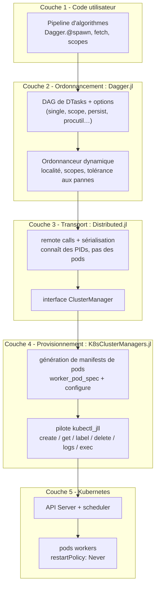
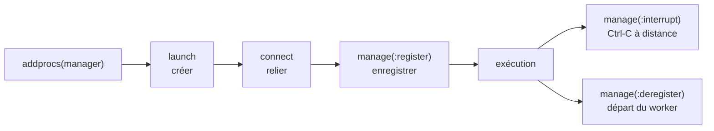
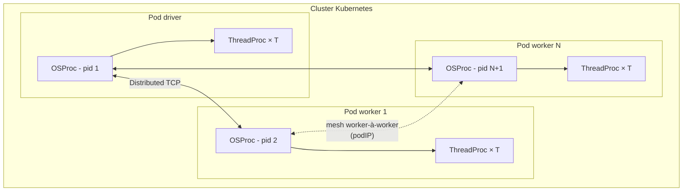
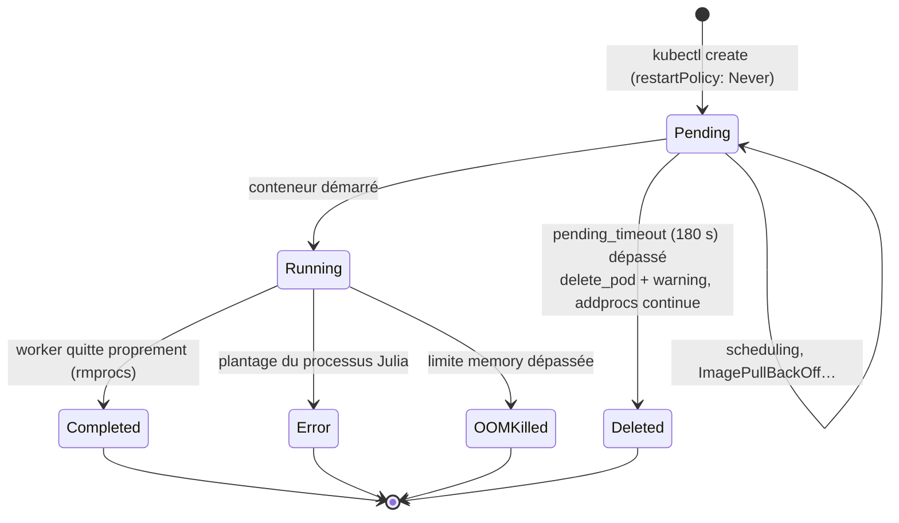
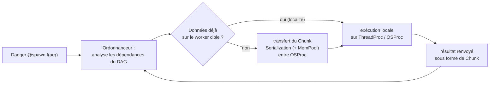

# 02 - Architecture

## 2.1 Vue en couches



Point clé : **chaque couche ignore les détails de la couche inférieure**. Dagger manipule des
« processus » (PIDs Distributed) ; Distributed manipule des « workers » abstraits via le
`ClusterManager` ; K8sClusterManagers traduit cela en appels `kubectl` ; Kubernetes place les
pods.

## 2.2 Le protocole `ClusterManager` de Distributed

Un `ClusterManager` doit surcharger trois méthodes. Le tableau croise chaque méthode avec son
implémentation dans `K8sClusterManager` :

| Méthode Distributed | Rôle | Implémentation K8sClusterManagers (v0.1.5) |
|---|---|---|
| `Distributed.launch(manager, params, launched, cond)` | créer les processus workers | génère le manifest pod (`worker_pod_spec` + `configure`), `kubectl create`, attend `Running`, ouvre `kubectl logs -f`, publie des `WorkerConfig` |
| `Distributed.connect(manager, pid, config)` | ouvrir la connexion TCP du driver vers le worker | lit l'annonce host/port du worker (`--worker`), résout la vraie adresse (`podIP` ou port-forward), connecte le socket |
| `Distributed.manage(manager, id, config, op)` | superviser le cycle de vie | `:register` → label `worker-id` ; `:interrupt` → `kubectl exec kill -2` ; `:deregister` → arrêt du port-forward + diagnostic de terminaison |



## 2.3 Séquence complète de `addprocs(K8sClusterManager(np))`

```mermaid
sequenceDiagram
    autonumber
    participant App as Code utilisateur
    participant Drv as Driver Julia
    participant KCM as K8sClusterManager
    participant Kct as kubectl_jll
    participant API as API Server K8s
    participant Pod as Pod worker

    App->>Drv: addprocs(K8sClusterManager(np))
    Drv->>KCM: Distributed.launch(manager, params, launched, cond)
    KCM->>KCM: worker_pod_spec(...) puis configure(pod)
    loop pour i = 1..np (tâches asynchrones parallèles)
        KCM->>Kct: kubectl create -f - (manifest JSON)
        Kct->>API: POST Pod (generateName)
        API-->>Kct: pod/&lt;nom&gt; créé
        KCM->>Kct: kubectl get pod/&lt;nom&gt; -o json (sondage 1 s)
        API-->>KCM: phase = Running
        KCM->>Kct: kubectl logs -f pod/&lt;nom&gt;
        Kct-->>Drv: flux stdout/stderr du worker
        KCM-->>Drv: WorkerConfig(io, userdata=(pod_name, port_forward))
        KCM-->>Drv: notify → worker « lancé »
    end
    Drv->>Pod: le worker annonce host:port (--worker=cookie)
    alt manager dans le cluster
        Drv->>Pod: TCP direct vers podIP:port
    else manager hors du cluster
        Drv->>Kct: kubectl port-forward --address localhost pod/&lt;nom&gt; :port
        Drv->>Pod: TCP via le tunnel localhost
    end
    Drv->>Pod: poignée de main Distributed (cookie)
    Drv->>KCM: manage(:register)
    KCM->>Kct: kubectl label pod/&lt;nom&gt; worker-id=&lt;pid&gt;
```

Trois détails d'implémentation notables (source `src/native_driver.jl`) :

1. **`--bind-to=0.0.0.0`** : le worker écoute sur toutes les interfaces - nécessaire au
   port-forward (l'adresse annoncée par Julia est sinon non routable hors du pod).
2. **`exename` forcé à `julia`** si l'image commence par `julia:` : les images officielles
   placent le binaire à cet endroit.
3. **Démarrage partiel toléré** : si un pod reste `Pending` au-delà de `pending_timeout`
   (180 s par défaut), il est supprimé, un avertissement est émis et `addprocs` **continue
   avec les workers déjà disponibles** (`<= np`).

## 2.4 Hiérarchie des processeurs vus par Dagger

Dagger modélise le matériel comme un arbre multi-racines : une racine `OSProc` **par processus
OS** (le driver *et* chaque pod worker), avec des enfants `ThreadProc` (un par thread Julia
`-t N`). C'est cette hiérarchie que l'ordonnanceur parcourt pour placer les tâches.



Conséquences pratiques :

- **-t 2 dans `exeflags`** donne 2 processeurs par pod → Dagger peut y placer 2 tâches
  simultanées par défaut (occupation complète supposée).
- Les processeurs GPU (via `DaggerGPU.jl` / extensions `CUDA`, `AMDGPU`, `Metal`, `oneAPI`,
  `OpenCL`) s'ajoutent comme enfants - désactivés par défaut, activables par scopes.

## 2.5 Cycle de vie d'un pod worker



Au `:deregister`, le manager attend jusqu'à 30 s (grace period K8s par défaut) la terminaison
du pod et émet un `@warn` si la raison n'est pas `Completed` - c'est le principal signal
d'une mort anormale (OOM, plantage). **Aucune suppression automatique** des pods : le
nettoyage se fait par label (chapitre 07).

## 2.6 Flux de données d'une tâche



Le mouvement de données par défaut se décompose en trois déplacements : processeur A →
`OSProc` parent de A, `OSProc` de A → `OSProc` de B (réseau Distributed), puis vers le
processeur B. Tout doit être **sérialisable** ; les gros objets transitent via `MemPool`.

→ Suite : [03 - K8sClusterManagers.jl](03-k8sclustermanagers.md)
