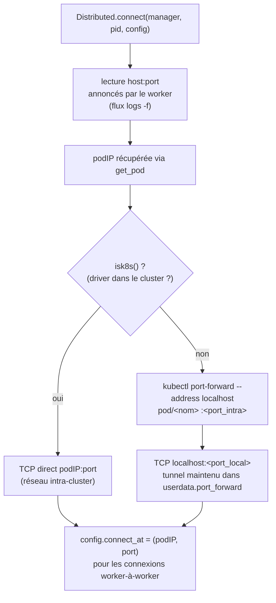
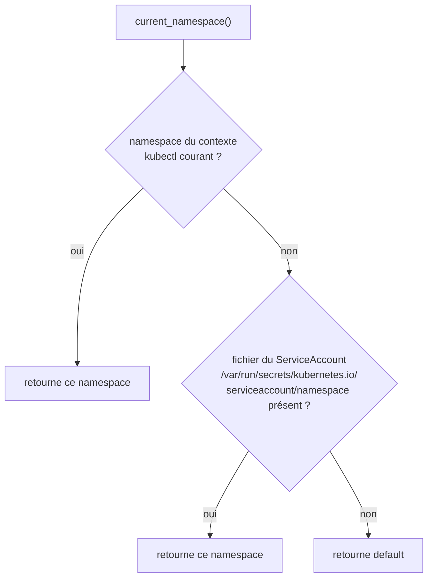
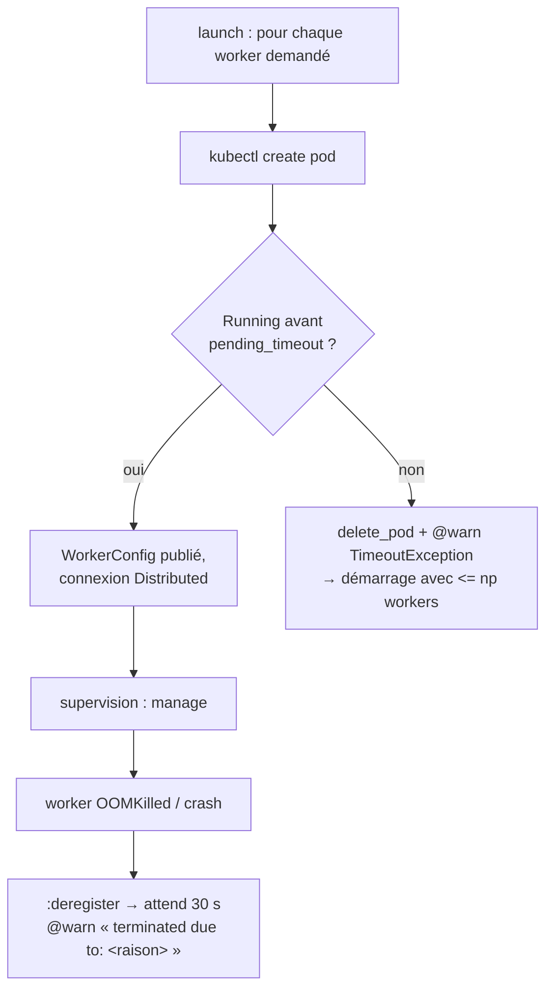

# 03 - K8sClusterManagers.jl en profondeur

> Source de vérité : `beacon-biosignals/K8sClusterManagers.jl` **v0.1.5** -
> exports `K8sClusterManager`, `KubeError`, `isk8s` ; dépendances `kubectl_jll` (kubectl 1.20),
> `Distributed`, `JSON`, `DataStructures`, `Mocking`.

## 3.1 Installation

```julia
import Pkg; Pkg.add("K8sClusterManagers")
```

Aucun `kubectl` externe n'est requis : le paquet embarque le binaire via `kubectl_jll`
(compat = 1.20). Si la plateforme n'est pas supportée, `__init__` échoue dès le `using`.

## 3.2 API publique

### `K8sClusterManager(np::Integer; kwargs...) <: Distributed.ClusterManager`

Demande `np` pods workers ; le démarrage peut se faire avec **moins** de workers si le
cluster manque de ressources (voir `pending_timeout`).

| Mot-clé | Défaut | Rôle |
|---|---|---|
| `namespace` | `current_namespace()` | namespace où créer les pods workers |
| `manager_pod_name` | `gethostname()` si in-cluster, sinon `nothing` | nom du pod manager (sert aux dérivations par défaut) |
| `worker_prefix` | `"$(manager_pod_name ou hostname)-worker"` | préfixe des noms de pods (`generateName`) **et** du label de nettoyage |
| `image` | image du pod manager (in-cluster) sinon `"julia:$VERSION"` | image des workers |
| `cpu` | `"1"` | CPU demandé **et** limité (`requests == limits`) |
| `memory` | `"4Gi"` | mémoire demandée **et** limitée (suffixes K8s : `Gi`, …) |
| `pending_timeout` | `180` (s) | attente maximale de `Pending` → `Running` ; au-delà : suppression du pod + avertissement, poursuite avec les workers restants |
| `configure` | `identity` | hook `configure(pod) -> pod` pour modifier le manifest (§3.6) |

Usage minimal (le README officiel) :

```julia
using K8sClusterManagers, Distributed
addprocs(K8sClusterManager(2))
```

### Autres exports et utilitaires

| Fonction | Signature | Rôle |
|---|---|---|
| `isk8s` | `() -> Bool` | `true` si `KUBERNETES_SERVICE_HOST` et `KUBERNETES_SERVICE_PORT` sont définis (in-cluster) |
| `get_pod` | `(name) -> AbstractDict` | détails du pod en JSON (`KubeError` si absent) |
| `create_pod` | `(manifest) -> String` | crée un pod (`kubectl create -f -`), retourne son nom |
| `label_pod` | `(name, label::Pair)` | labelise un pod - nécessite le verbe **patch** |
| `delete_pod` | `(name; wait=true)` | supprime le pod |
| `wait_for_running_pod` | `(name; timeout)` | sonde (1 s) jusqu'à la phase `Running` ; `TimeoutException` sinon |
| `exec_pod` | `(name, cmd)` | `kubectl exec` (utilisé pour `:interrupt`) |
| `pod_status` | `(name ou manifest) -> Pair` | état du conteneur et sa raison (`Completed`, `OOMKilled`…) - pods mono-conteneur uniquement |

## 3.3 Manifest généré (`worker_pod_spec`)

```yaml
apiVersion: v1
kind: Pod
metadata:
  generateName: "<worker_prefix>-"        # nom unique généré par l'API
  labels:
    worker-prefix: "<worker_prefix>"      # cible de nettoyage groupé
    cluster-cookie: "<cookie Distributed>"
spec:
  restartPolicy: Never                    # un worker ne redémarre pas seul
  # serviceAccountName: ...               # uniquement si fourni (via configure)
  containers:
  - name: worker
    image: "<image>"
    command: ["julia", "<exeflags…>", "--worker=<cookie>", "--bind-to=0.0.0.0"]  # exeflags éclaté en un argument par flag
    resources:
      requests: { cpu: "<cpu>", memory: "<memory>" }
      limits:   { cpu: "<cpu>", memory: "<memory>" }   # identiques aux requests
```

Le **cookie Distributed** est porté par un label - il ne sert qu'au filtrage diagnostique ;
l'authentification réelle se fait dans le protocole `--worker`.

## 3.4 Choix de la route de connexion



- **In-cluster** : performances réseau du cluster ; `connect_at` expose la `podIP` pour le
  mesh worker-à-worker de Distributed.
- **Hors-cluster** : un processus `kubectl port-forward` **par worker**, conservé dans
  `config.userdata.port_forward` et tué au `:deregister`. Le débit est celui de la liaison
  poste ↔ cluster.

## 3.5 Découverte du namespace



Ordre : contexte `kubeconfig` → fichier ServiceAccount du pod → `default`.

## 3.6 Le hook `configure`

`configure(pod) -> pod` reçoit le manifest (dict ordonné type JSON) avant création et doit le
retourner (mutation ou copie). C'est **le** point d'extension : tolérances, nœuds, volumes,
ServiceAccount des workers, sidecars…

```julia
# Exemple du README officiel : exiger un GPU par worker
function my_gpu_configurator(pod)
    worker_container = pod["spec"]["containers"][1]
    worker_container["resources"]["limits"]["nvidia.com/gpu"] = 1
    return pod
end

addprocs(K8sClusterManager(4; configure = my_gpu_configurator))
```

Autre cas fréquent : donner un ServiceAccount aux **workers** (le constructeur ne l'expose pas
directement) :

```julia
function avec_sa!(pod)
    pod["spec"]["serviceAccountName"] = "julia-worker"
    return pod
end
```

Pour inspecter le point de départ : `K8sClusterManagers.worker_pod_spec(; worker_prefix="ex",
image="julia", cmd=\`julia\`)` puis `JSON.print(pod, 4)`.

## 3.7 RBAC requise

Chaque opération du paquet se traduit en verbes Kubernetes :

| Opération interne | Commande `kubectl` | Verbes / ressources |
|---|---|---|
| créer les workers | `kubectl create -f -` | `create` sur `pods` |
| interroger l'état (`get_pod`, `wait_for_running_pod`, `pod_status`, `podIP`) | `kubectl get pod -o json` | `get`, `list`, `watch` sur `pods` (et `pods/status`) |
| labeliser `worker-id` (`:register`) | `kubectl label --overwrite` | `patch` sur `pods` |
| supprimer (timeout, nettoyage) | `kubectl delete pod` | `delete` sur `pods` |
| flux de logs (`logs -f`) | `kubectl logs -f` | `get` sur `pods/log` |
| interruption (`:interrupt`) | `kubectl exec` | `create` sur `pods/exec` |
| port-forward (driver **hors** cluster) | `kubectl port-forward` | `create`, `get` sur `pods/portforward` |

Le manifest prêt à l'emploi (ServiceAccount + Role + RoleBinding) figure au
[chapitre 06](06-deploiement.md). Le `:register` est présenté par la source comme
« nice-to-have » : en l'absence du verbe `patch`, il ne doit pas bloquer le démarrage.

## 3.8 Tolérance aux pannes côté provisionnement



Lecture : le provisionnement **dégrade proprement** au démarrage (moins de workers que
demandé) mais ne **relance pas** les pods morts ensuite - c'est Distributed qui déclare le
worker perdu, et Dagger qui recompute (§4.8, §5.6).

## 3.9 Diagnostics officiels (README)

```sh
kubectl get pods,services                                   # vue d'ensemble
kubectl logs -f pod/<driver-pod>-worker-9001               # stdout d'un worker
kubectl describe pod/<pod>                                  # pourquoi ça démarre mal
kubectl delete pod/<pod> --grace-period=0 --force=true     # tuer un worker récalcitrant
kubectl delete pod -l 'worker-prefix=<préfixe>'            # tout nettoyer d'un coup
```

⚠️ Erreurs `deserialize` ⇒ **même version de Julia** sur le driver et tous les workers.

→ Suite : [04 - Dagger.jl](04-dagger.md)
