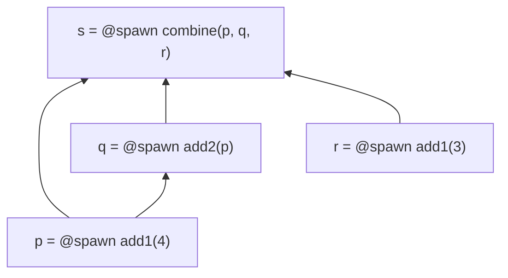
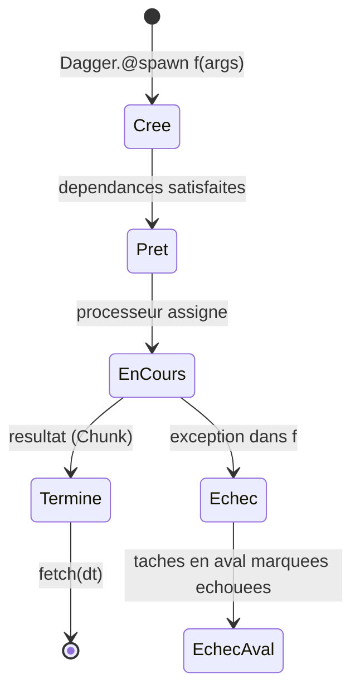
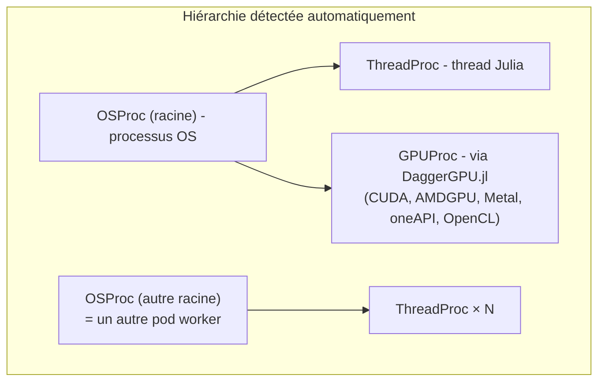
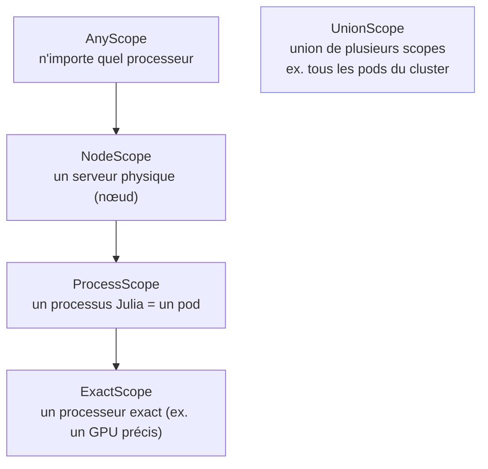
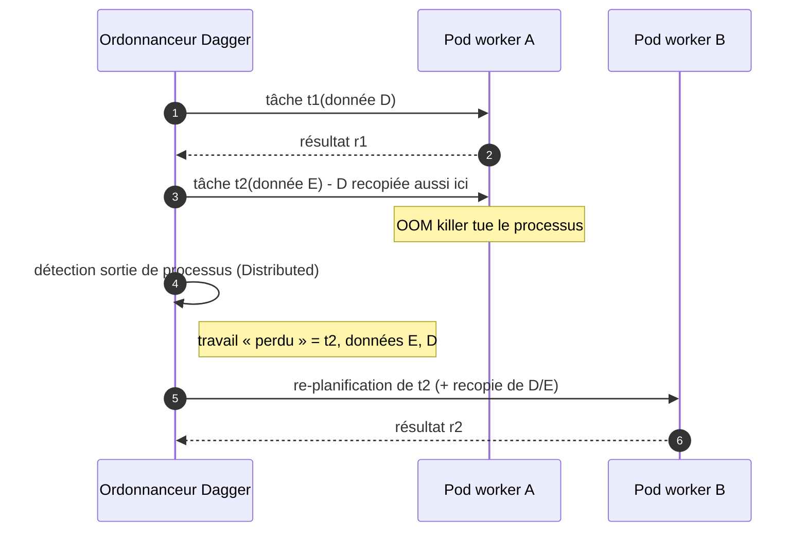

# 04 - Dagger.jl en profondeur

> Source de vérité : `JuliaParallel/Dagger.jl` **0.22.3** (master) - Julia ≥ 1.10 ;
> dépend notamment de `Distributed`, `DistributedNext`, `MemPool`, `TimespanLogging`.

## 4.1 Modèle de programmation

Dagger exécute votre code comme un **graphe orienté acyclique (DAG)** de tâches. L'entrée
moderne est **eager** (comme `@async` / `Threads.@spawn`) : chaque `Dagger.@spawn` crée un
`DTask` immédiatement soumis à un ordonnanceur vivant ; les `DTask` passés en arguments
d'autres tâches deviennent des **dépendances**.



```julia
using Dagger
p = Dagger.@spawn add1(4)
q = Dagger.@spawn add2(p)
r = Dagger.@spawn add1(3)
s = Dagger.@spawn combine(p, q, r)
@assert fetch(s) == 16
```

## 4.2 `@spawn` : syntaxes et résultats



- **Récupérer** : `fetch(dt)` (re-lève l'erreur d'origine si échec), `wait(dt)`,
  `isready(dt)` ; intégration avec `@sync`.
- **Depuis n'importe quel worker** : `@spawn` peut être appelé sur un worker non-1
  (exécution imbriquée, récursion dynamique).
- **Syntaxes acceptées** : appel classique, broadcast (`@spawn A .+ B`), `do`-blocs,
  fonctions anonymes, `getindex`/`setindex!` (ce dernier sur `Dagger.@mutable`),
  `getproperty`, `NamedTuple`.

Forme complète : `Dagger.@spawn [option=valeur]... f(args...)` ou
`Dagger.spawn(f, Dagger.Options(; ...), args...)`.

## 4.3 Options de tâches et du scheduler

| Option | Portée | Effet |
|---|---|---|
| `scope=Dagger.scope(worker=<pid>)` | tâche | restreindre l'exécution à un processus précis (ex. `worker=1` → driver) - remplace `single=<pid>`, **déprécié en 0.22** |
| `scope=Dagger.scope(...)` | tâche/fonction/données | restreindre le périmètre d'exécution (§4.7) |
| `occupancy=Dict(Dagger.ThreadProc=>0)` | tâche | déclarer une faible occupation (tâches IO-bound) |
| `options.procutil` | tâche | fraction de ressource utilisée (0.1 = 10 % d'un thread) |
| `meta=true` | tâche | passer les `Chunk` bruts à `f` plutôt que leur valeur |
| `get_result=true` | tâche | renvoyer la valeur directe au scheduler (avancé) |
| `persist=true` | tâche | ne pas libérer le résultat quand il devient inutilisé |
| `cache=true` | tâche | réutiliser le résultat si la tâche est ré-évaluée |
| `allow_error=true` | scheduler (lazy) | propager les échecs comme valeurs |

Options globales (API lazy) : `Dagger.Sch.SchedulerOptions(; single=1)` passé à
`collect(t; options=opts)` (`single` y est aussi déprécié au profit des scopes).

## 4.4 Erreurs et annulation

- Échec d'une tâche ⇒ **toutes les tâches en aval** sont marquées échouées ; `fetch` re-lève
  l'erreur d'origine. (`wait`/`isready` ne vérifient pas l'échec.)
- `Dagger.cancel!(t)` : abandonne une tâche (sûr - elle finit en arrière-plan) ;
  `force=true` déconseillé (fuites, segfaults possibles) ; `cancel!(; halt_sch=true)` arrête
  tout le scheduler (redémarré au prochain `@spawn`).

## 4.5 API paresseuse (héritage)

`Dagger.@par` / `Dagger.delayed` construisent le DAG **avant** exécution, et
`compute`/`collect` lancent un scheduler jetable. Déconseillé : latence de construction,
pas d'expansion dynamique, pas de partage de métriques ni de données entre schedulers.
À réserver au code historique :

```julia
s = Dagger.@par begin
    p = add1(4); q = add2(p); r = add1(3)
    combine(p, q, r)
end
@assert collect(s) == 16
```

## 4.6 Processeurs



- `Dagger.tochunk(valeur, proc, scope)` : attacher une donnée à un processeur/scope.
- `Dagger.task_processor()` : processeur courant (utile pour figer le contexte d'une ressource).
- Défaut : calcul CPU, **mono-thread par nœud** ; le multi-threading et les GPU
  s'activent via les scopes.
- Déplacement de données : `Serialization` (+ `MemPool`) - tout doit être sérialisable.

## 4.7 Scopes



```julia
# Verrouiller une donnée (pointeur C, modèle ML…) au processus qui l'a créée :
h = Dagger.@spawn get_handle()                       # s'exécute quelque part
c = Dagger.@spawn scope=Dagger.scope(worker=myid()) read(h)
```

Règles : l'intersection des scopes d'une tâche doit être non vide, sinon **erreur
d'ordonnancement**. Les scopes sont un outil de **correction** (intimité des données), pas
d'optimisation : ils réduisent les possibilités du scheduler.

## 4.8 Tolérance aux pannes (fault tolerance)

Cible assumée : la **perte inattendue d'un worker** (typiquement l'OOM killer Linux →
pod `OOMKilled`).



Limite documentée : couvre **uniquement** la perte de workers ; la mort du driver
(master) ou une coupure réseau nécessiteraient multi-master/checkpointing - pas implémentés.

## 4.9 Pools de workers dynamiques

L'ordonnanceur élastique accepte l'arrivée/départ de processeurs pendant l'exécution :

```julia
ctx = Dagger.Context()
job = @async collect(ctx, tas)      # le scheduler tourne
ps = addprocs(2; exeflags="--project=/app")   # ou addprocs(K8sClusterManager(...))
@everywhere ps using Distributed, Dagger
addprocs!(ctx, ps)                  # les nouveaux workers prennent des tâches
rmprocs(ctx, ps)                    # finissent leur travail, plus de nouvelles tâches
```

Scénario élastique K8s : ajouter des pods pendant une vague de charge, en retirer ensuite -
avec la difficulté documentée de déterminer quand un worker n'est plus utilisé.

## 4.10 Observabilité

- **TimespanLogging** (dépendance directe) : profils d'exécution par spans.
- **DaggerWebDash** (paquet séparé) : tableau de bord web temps réel du scheduler.
- Visualisation du DAG (extension GraphViz, Plots).

→ Suite : [05 - Intégration K8s × Dagger](05-integration.md)
