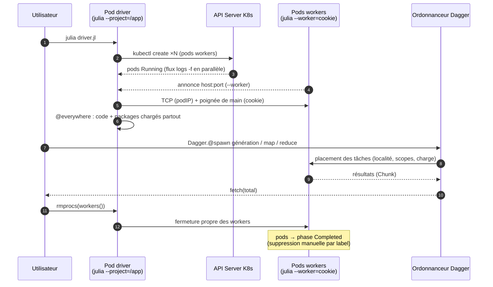
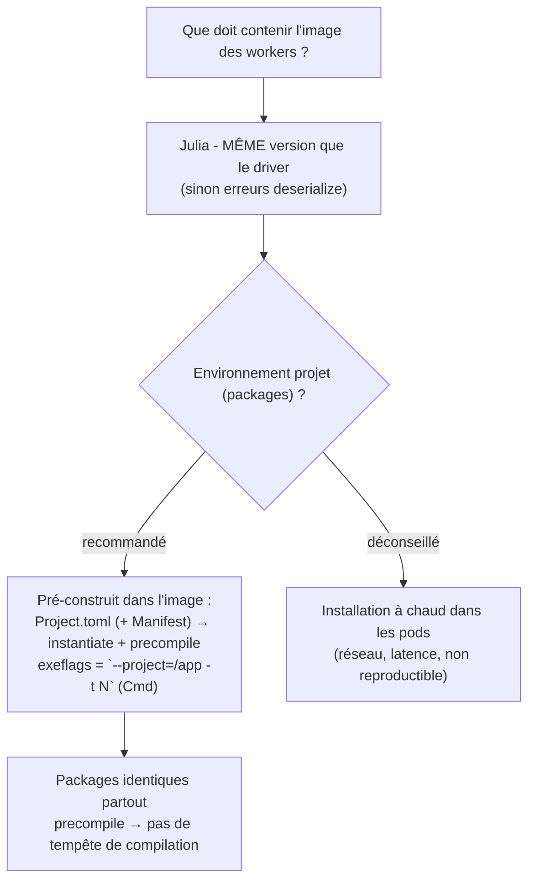
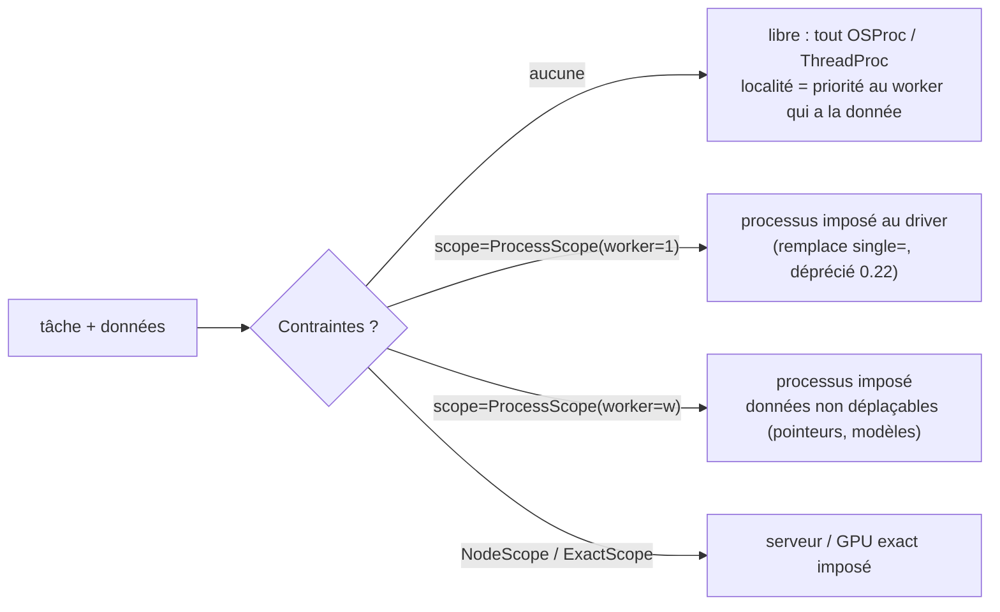
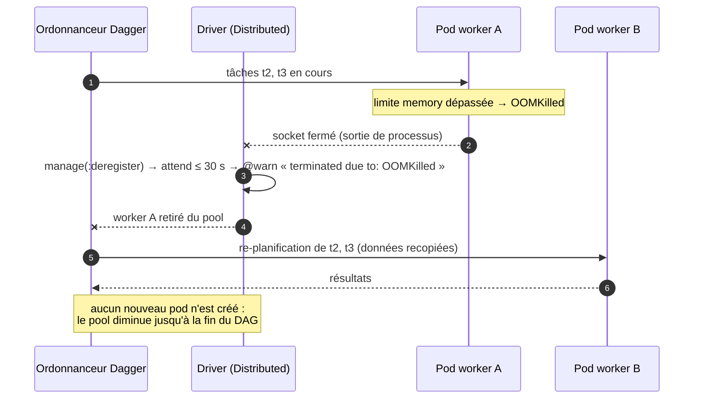
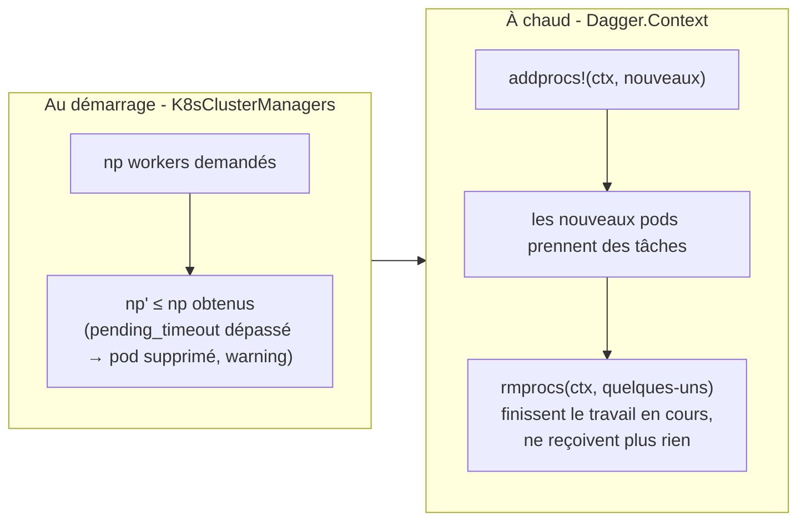

# 05 - Intégration : K8sClusterManagers × Dagger

## 5.1 Le contrat entre les deux paquets

Chaque paquet suppose des garanties offertes par l'autre. Le tableau fixe le contrat :

| Paquet | Attend | Offre en retour |
|---|---|---|
| `K8sClusterManagers` | que les workers parlent le protocole `--worker` de Distributed (cookie), que l'image contienne un Julia fonctionnel | des processus Julia dans des pods, connus de `workers()`, avec flux de logs et diagnostics K8s |
| `Dagger` | des processus Distributed stables, avec le **même environnement logiciel** partout | placement dynamique des tâches sur ces processus (`OSProc`/`ThreadProc`), reprise après perte d'un worker |
| L'utilisateur | cohérence de versions et d'environnements | un pipeline declaratif : `addprocs` → `@everywhere` → `@spawn` |

## 5.2 Flux de bout en bout



Le squelette Julia correspondant (version commentée complète : [`examples/driver.jl`](../examples/driver.jl)) :

```julia
using Distributed, K8sClusterManagers, Dagger

addprocs(K8sClusterManager(4; cpu="2", memory="8Gi");
         exeflags=`--project=/app -t 2`)   # Cmd (backticks) : plusieurs flags

@everywhere using MonPackage           # environnement pré-construit dans l'image

tâches = [Dagger.@spawn persist=true MonPackage.générer(s) for s in 1:32]
résultats = [Dagger.@spawn MonPackage.traiter(t) for t in tâches]
total = fetch(Dagger.@spawn +(résultats...))

rmprocs(workers())
```

## 5.3 Environnement logiciel des workers

C'est le point le plus critique de l'intégration : **les pods sont des processus Julia
neufs** - rien n'y est installé à l'exécution si l'image ne le contient pas.



Règles d'or :

1. **Même version de Julia** driver ↔ workers (les erreurs `deserialize` en sont le symptôme
   n°1, cf. README officiel).
2. **Même environnement de packages** : `--project=/app` dans `exeflags`, `/app` étant
   instancié **au build** de l'image.
3. **`-t N`** dans `exeflags` donne N `ThreadProc` par pod - c'est la granularité de
   parallélisme intra-pod de Dagger. `exeflags` avec plusieurs flags **doit** être
   un `Cmd` (backticks : `` `--project=/app -t N` ``) ; un `String` n'est valide
   que pour un flag unique.
4. **Précompilation au build** (`Pkg.precompile()`) évite que chaque pod compile les paquets
   à son démarrage.

## 5.4 Placement et localité



En pratique sur K8s :

- `persist=true` sur les jeux de données intermédiaires : les blocs restent sur le pod qui
  les a produits et les tâches en aval y affluent (localité).
- `scope=Dagger.scope(worker=1)` pour les opérations à effet de bord côté driver
  (écriture disque du driver, agrégats finaux légers) - `single=1`, l'ancienne forme,
  est déprécié en Dagger 0.22.
- `scope=Dagger.scope(worker=<pid>)` pour une ressource non sérialisable créée dans un pod.

## 5.5 Scénario de panne : worker `OOMKilled`



Comportement à retenir : **Dagger recompute** le travail perdu, mais **K8sClusterManagers ne
relance pas** de pod pour un worker mort après le démarrage. La fiabilité se dimensionne
donc à deux niveaux : mémoire des pods (limite > pic mémoire des tâches) et nombre de
workers restants suffisant pour finir le DAG.

## 5.6 Scalabilité : dégradé au départ, élastique ensuite



Deux leviers complémentaires :

- **démarrage tolérant** : un cluster sous-dimensionné démarre quand même, avec moins de
  workers que demandé (`pending_timeout`) ;
- **élasticité applicative** : `addprocs!(ctx, …)` / `rmprocs(ctx, …)` sur le `Context`
  de l'ordonnanceur, pendant que le DAG tourne (l'ajout de workers reste un
  `addprocs(K8sClusterManager(k))` classique côté K8s).

## 5.7 Pièges classiques

| Symptôme | Cause probable | Remède |
|---|---|---|
| `deserialize` errors à la connexion | versions de Julia différentes driver/workers | image unique (`julia:1.10`), driver lancé depuis la même image |
| `MethodError`/`UndefVarError` dans une tâche | code/packages absents des workers | `@everywhere` ou `using MonPackage` **après** `addprocs`, environnement pré-construit dans l'image |
| Chaque pod compile les packages au démarrage | pas de précompilation dans l'image | `Pkg.precompile()` au build ; `JULIA_DEPOT_PATH` stable |
| Tâches lentes, pods quasi oisifs | scopes trop restrictifs (ex. tout forcé sur le driver) | réserver les scopes aux cas nécessaires (§5.4) |
| Workers tués en plein calcul (`OOMKilled`) | limite memory < pic mémoire des tâches + buffers de sérialisation | augmenter `memory`, découper les données, `procutil` |
| `addprocs` pend ~3 min puis démarre avec moins de workers | pods `Pending` (ressources insuffisantes) | `kubectl describe pod`, ajuster `cpu`/`memory`/`pending_timeout` |
| Pods workers accumulés en `Completed` | pas de suppression automatique (par conception) | nettoyage par label (chapitre 07, `04-cleanup.sh`) |

→ Suite : [06 - Déploiement](06-deploiement.md)
