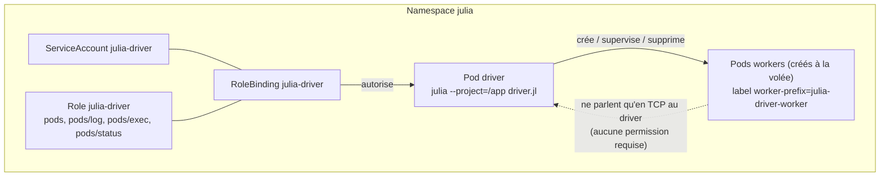
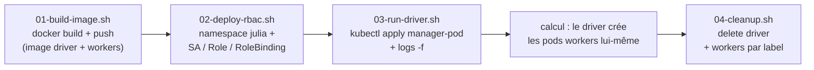
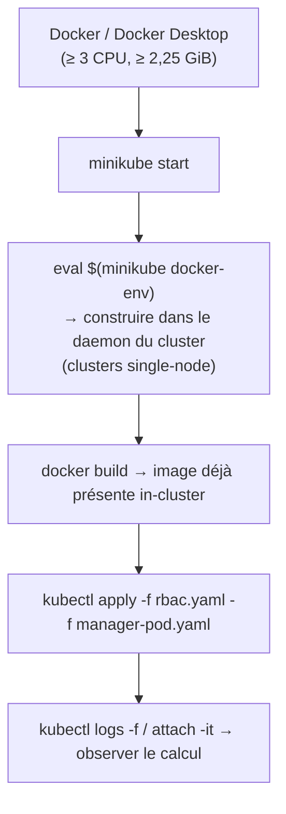

# 06 - Déploiement : artefacts et scripts

> Cadre théorique : tous les fichiers cités sont fournis dans [`examples/`](../examples),
> prêts à adapter. **Aucun cluster n'est installé ni exécuté ici.**

## 6.1 Arborescence et objets Kubernetes

```text
examples/
├── dagger-basiques.jl      # exemples Julia Dagger SANS cluster (mono-processus)
├── scopes-et-elasticite.jl # patterns avancés : scopes, UnionScope, pool élastique
├── driver.jl               # driver Julia complet commenté (point d'entrée K8s)
├── Dockerfile              # image commune driver + workers
├── Project.toml            # environnement exemple (Dagger, K8sClusterManagers)
├── rbac.yaml               # ServiceAccount + Role + RoleBinding du driver
├── manager-pod.yaml        # pod driver (batch, restartPolicy: Never)
├── 01-build-image.sh       # docker build (+ push)
├── 02-deploy-rbac.sh       # namespace + RBAC
├── 03-run-driver.sh        # lancement du driver + suivi des logs
└── 04-cleanup.sh           # suppression driver + pods workers par label
```



Point de sécurité : les **workers n'ont besoin d'aucune permission RBAC** - ils ne parlent
qu'en TCP avec le driver. Seul le pod driver porte `julia-driver`.

## 6.2 `driver.jl` - le driver commenté

Fichier complet : [`examples/driver.jl`](../examples/driver.jl). Points saillants :

```julia
# 1) Le hook configure : la seule porte pour poser serviceAccountName
#    sur les workers (non exposé par le constructeur)
function avec_service_account!(pod)
    pod["spec"]["serviceAccountName"] = "julia-worker"
    return pod
end

# 2) Provisionnement : 4 pods, 2 CPU / 8 GiB chacun, 5 min de patience
manager = K8sClusterManager(4; cpu="2", memory="8Gi",
                            pending_timeout=300, configure=avec_service_account!)

# 3) Démarrage : environnement pré-construit dans l'image + 2 threads/pod
#    (exeflags = Cmd en backticks : obligatoire dès qu'il y a plusieurs flags)
addprocs(manager; exeflags=`--project=/app -t 2`)

# 4) Pipeline Dagger (génération → map → reduce), puis rmprocs(workers())
```

Le pipeline montre : `persist=true` (données intermédiaires), le reduce splatté
`+(résultats...)`, le placement par scope (`scope=Dagger.scope(worker=1)`, tâche forcée sur
le driver - `single=` étant déprécié en 0.22) et le renvoi vers les scopes avancés.

## 6.3 `Dockerfile` - image unique driver + workers

Fichier : [`examples/Dockerfile`](../examples/Dockerfile). Principe :

```dockerfile
FROM julia:1.10                     # version unique imposée driver/workers
WORKDIR /app
COPY Project.toml ./                # (+ Manifest.toml recommandé : versions épinglées)
RUN julia --project=/app -e 'using Pkg; Pkg.instantiate(); Pkg.precompile()'
COPY src/ ./src/                    # code applicatif
COPY driver.jl ./
```

Trois exigences répétées des chapitres précédents : **même Julia partout**, environnement
**instancié au build**, **précompilation** pour éviter la tempête de compilation au
démarrage de chaque pod.

## 6.4 `rbac.yaml` - identité et permissions du driver

Fichier : [`examples/rbac.yaml`](../examples/rbac.yaml). Le mappage verbes ↔ opérations
internes est détaillé au [chapitre 03 §3.7](03-k8sclustermanagers.md) :

| Ressource | Verbes | Pourquoi |
|---|---|---|
| `pods` | get, list, watch, create, patch, delete | `create_pod`, `get_pod`, `label_pod` (`:register`), `delete_pod` |
| `pods/log` | get | flux `logs -f` (démarrage + diagnostics) |
| `pods/exec` | create | `:interrupt` (`kill -2` à distance) |
| `pods/status` | get | `pod_status` (diagnostic `OOMKilled`…) |
| `pods/portforward` | create, get | **uniquement** driver hors-cluster |

## 6.5 `manager-pod.yaml` - le pod driver

Fichier : [`examples/manager-pod.yaml`](../examples/manager-pod.yaml).

```yaml
spec:
  serviceAccountName: julia-driver   # les permissions du §6.4
  restartPolicy: Never               # un driver est un batch
  containers:
    - name: driver
      image: registry.example.com/mon-equipe/julia-app:1.10
      command: ["julia", "--project=/app", "driver.jl"]
      env: [{ name: NP_WORKERS, value: "4" }]
      resources:
        requests: { cpu: "1", memory: "4Gi" }
        limits:   { cpu: "1", memory: "4Gi" }
```

Variante interactive du README officiel (REPL dans le cluster) :

```sh
kubectl run -it example-manager-pod --image julia:1
# ou : kubectl apply -f <manifest> ; kubectl attach -it pod/example-manager-pod
```

## 6.6 Scripts shell - cycle de vie complet



| Script | Rôle | Commandes clés |
|---|---|---|
| `01-build-image.sh` | construire/pousser l'image | `docker build`, `docker push` |
| `02-deploy-rbac.sh` | préparer le namespace et la RBAC | `kubectl apply -f rbac.yaml` |
| `03-run-driver.sh` | lancer le driver et suivre les logs | `kubectl apply -f manager-pod.yaml`, `kubectl logs -f` |
| `04-cleanup.sh` | tout nettoyer | `kubectl delete pod/julia-driver`, `kubectl delete pod -l worker-prefix=julia-driver-worker` |

Les scripts sont volontairement **paramétrables par variables d'environnement** (`NAMESPACE`,
`REGISTRY`, `IMAGE`) et **ne créent aucun cluster** : ils supposent un contexte `kubectl`
déjà fonctionnel.

## 6.7 Workflow minikube (tests locaux, depuis le README officiel)



## 6.8 Cas « driver hors du cluster »

Un poste de travail (ou une CI) disposant d'un `kubeconfig` valide peut aussi piloter les
workers : `addprocs(K8sClusterManager(4))` depuis votre REPL local.

- La connexion se fait alors par **`kubectl port-forward` par worker**
  (tunnels maintenus dans `config.userdata.port_forward`, tués au `:deregister`) - cf.
  [chapitre 03 §3.4](03-k8sclustermanagers.md).
- Le verbe `pods/portforward` doit être accordé à l'identité du kubeconfig.
- **Performance** : tout le trafic Distributed (données sérialisées inclus) passe par la
  liaison poste ↔ cluster - acceptable pour l'exploration, pas pour de gros volumes.

→ Suite : [07 - Production](07-production.md)
