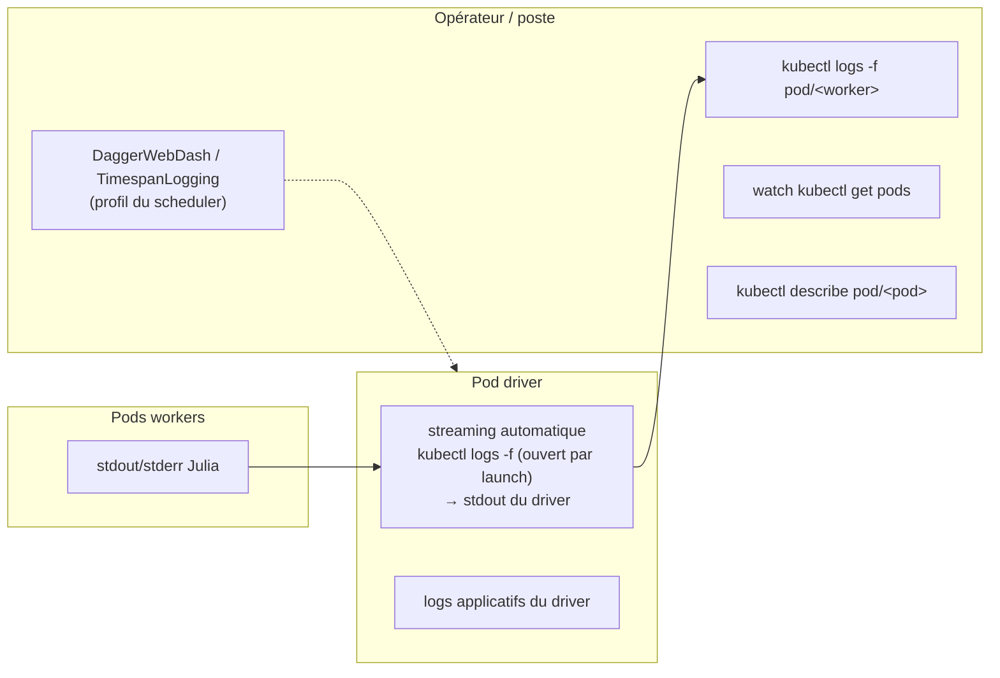
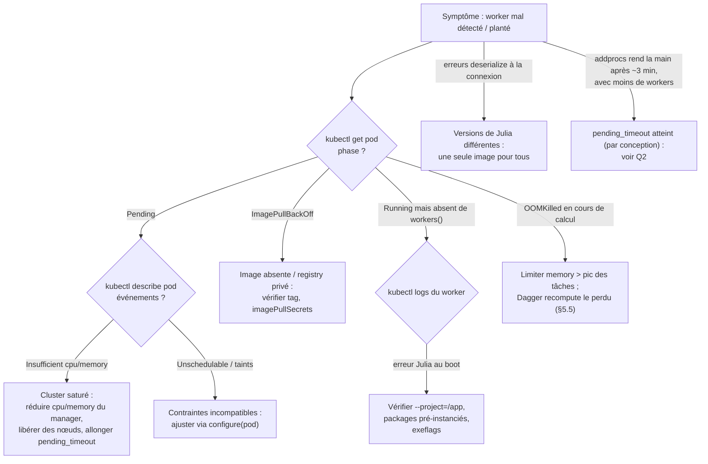
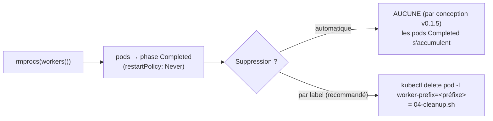

# 07 - Production : monitoring, diagnostic, sécurité

## 7.1 Observabilité



- **Logs workers** : redirigés automatiquement vers le driver (chaque `launch` ouvre un
  `kubectl logs -f` ; `start_worker` redirige déjà stderr vers stdout) - tout se lit donc
  aussi bien côté driver que par pod.
- **Labels utiles** : `worker-prefix` (nettoyage groupé), `worker-id` (pid Distributed,
  posé au `:register`), `cluster-cookie` (filtrage diagnostique).
- **Profiling Dagger** : `TimespanLogging` (intégré) et `DaggerWebDash` (paquet séparé)
  exposent la vue du scheduler - tâches, temps d'attente, déplacements de données.

## 7.2 Arbre de diagnostic



## 7.3 Gestion des ressources

- `K8sClusterManager` pose **requests == limits** (`cpu`, `memory`) → QoS `Guaranteed` :
  un worker n'est pas candidat à l'éviction mémoire sous pression de nœud… mais peut
  toujours être `OOMKilled` par sa **propre** limite.
- Dimensionnement mémoire : limite ≥ pic mémoire des tâches + tampons de sérialisation
  (les `Chunk` transitent et vivent dans le heap Julia du worker).
- `-t N` (threads Julia par pod) et `cpu` doivent rester cohérents : N tâches Dagger
  simultanées par pod si `-t N`, à charge totale `N × cpu`.
- Déclarer une sous-utilisation : `occupancy` / `options.procutil` (chapitre 04).

```julia
# Tâches IO-bound : n'occupent pas pleinement leur thread
tâches_io = [Dagger.@spawn occupancy=Dict(Dagger.ThreadProc => 0) attendre_réseau(i)
             for i in 1:100]
fetch.(tâches_io)
```

## 7.4 Nettoyage



Le préfixe par défaut dérive du nom du pod driver : `<driver-pod>-worker`. Le
`:deregister` d'un worker **anormalement** terminé émet en plus un
`@warn "Worker <id> on pod <name> was terminated due to: <raison>"` - à surveiller dans les
logs du driver (c'est là qu'apparaissent les `OOMKilled`).

## 7.5 Sécurité

| Sujet | Mesure |
|---|---|
| RBAC | Role **restreint au namespace**, verbes minimaux (chapitre 06) ; le `:register` (label `worker-id`) est tolérant à l'absence de `patch` |
| Workers | ServiceAccount dédié **sans aucun rôle** - ils ne font que du TCP avec le driver |
| Cookie Distributed | Secret de session ; il figure dans un **label de pod** (`cluster-cookie`) : limitez donc `get/list pods` aux seules identités de confiance du namespace |
| Image | Registry privé + `imagePullSecrets` ; préférez un `USER` non-root dans le Dockerfile |
| Interruptions | `:interrupt` exécute `kill -2` via `pods/exec` : n'accordez ce verbe qu'au driver |

## 7.6 Performance

| Levier | Effet | Exemple |
|---|---|---|
| Driver **dans** le cluster | trafic données en réseau cluster (vs port-forward hors-cluster) | `manager-pod.yaml` |
| `persist=true` | évite de recalculer/libérer des blocs réutilisés | `Dagger.@spawn persist=true générer(s)` |
| `cache=true` | réutilise un résultat déjà calculé | reduce ré-évalué |
| Granularité des tâches | trop fines → surcoût de scheduling/sérialisation ; regrouper | blocs de ~secondes, pas de microsecondes |
| Localité | laisser le scheduler placer les tâches **près des données** ; restreindre (scopes) uniquement pour la correction | §5.4 |
| Précompilation au build | pas de compilation JIT au boot de chaque pod | `Pkg.precompile()` dans le Dockerfile |

## 7.7 Limites opérationnelles connues (v0.1.5 / 0.22.x)

1. **Driver = point unique de défaillance** (la tolérance aux pannes de Dagger couvre les
   workers uniquement - documenté).
2. **Aucun redémarrage automatique** d'un worker mort après le démarrage : le pool
   rétrécit jusqu'à la fin du DAG.
3. **Pods mono-conteneur** : `pod_status` rejette les pods multi-conteneurs - prudence
   avec les sidecars injectés (service mesh…).
4. **Pas de suppression automatique** des pods à la fin (nettoyage par label).
5. **Hors-cluster** : un port-forward par worker, débit = liaison poste↔cluster.
6. **Distributed = sérialisation Julia** : tout ce qui transite doit être sérialisable,
   avec les mêmes types des deux côtés.

→ Suite : [08 - Limites et alternatives](08-limites-et-alternatives.md)
