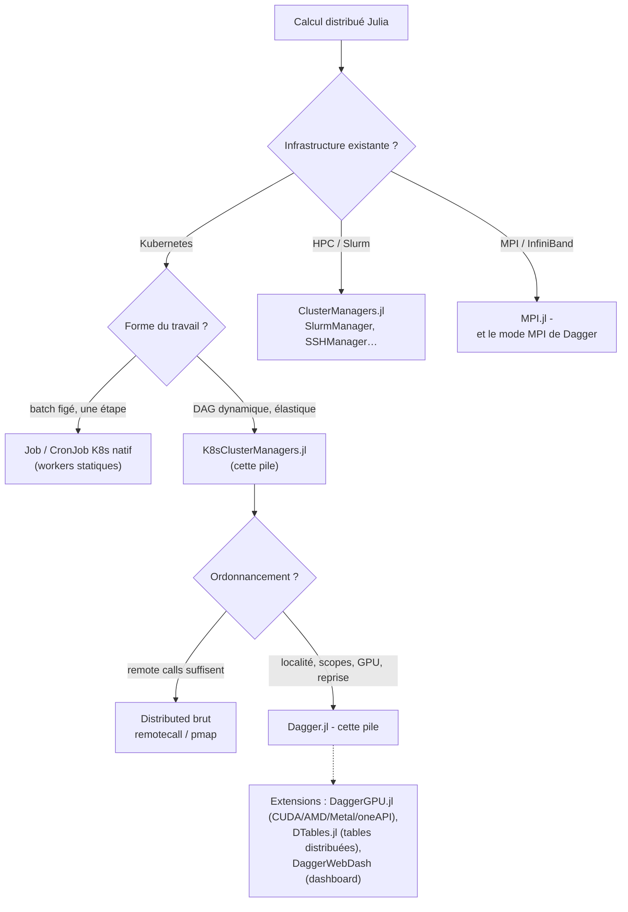

# 08 - Limites et alternatives

## 8.1 Synthèse des limites de la pile

| # | Limite | Impact | Atténuation |
|---|---|---|---|
| 1 | Driver SPOF (pas de multi-master/checkpointing) | une mort du driver tue le calcul | driver en pod `restartPolicy` adapté + découpage en DAGs courts relançables |
| 2 | Workers non relancés après démarrage | capacité décroissante en cas de pertes | sur-provisionner, `addprocs(K8sClusterManager(k))` complémentaires à chaud |
| 3 | Transferts par sérialisation Julia | gros volumes = coût réseau/CPU | localité (`persist`), granularité des chunks, données partagées par volume |
| 4 | Élasticité à chaud semi-automatique | `addprocs!/rmprocs!` manuels, fin d'utilisation d'un worker indéterminée | orchestration applicative (§4.9) |
| 5 | Pods mono-conteneur assumés | incompatible avec sidecars injectés | namespaces sans mesh, ou à valider au cas par cas |
| 6 | RBAC non triviale + nettoyage manuel | friction opérationnelle | scripts du chapitre 06, labels |

## 8.2 Écosystème et alternatives



| Option | Forces | Faiblesses vs notre pile |
|---|---|---|
| **K8sClusterManagers + Dagger** | DAG dynamique, localité des données, reprise sur perte de worker, élasticité à chaud | complexité RBAC/nettoyage, driver SPOF |
| **Job/CronJob K8s natif** | simple, standard, retries natifs | workers statiques, pas d'ordonnancement de tâches fin |
| **Distributed brut (`pmap`, `remotecall`)** | zéro dépendance, mental model simple | placement manuel, pas de localité ni de reprise |
| **ClusterManagers.jl (Slurm, SSH…)** | naturel sur HPC existant | hors écosystème K8s |
| **Dagger en mode MPI** | réseaux HPC rapides | autre modèle d'ops, moins « cloud natif » |
| **Banyan.jl** | ambition cloud-native Julia | développement arrêté (archivé) - non recommandé pour du neuf |

> Historique utile : la `DTable` a quitté Dagger pour [DTables.jl](https://github.com/JuliaParallel/DTables.jl) ;
> `DaggerGPU.jl` fournit les processeurs GPU ; `DistributedNext` est exploré comme
> successeur de `Distributed` dans les versions récentes.

## 8.3 Choisir : résumé en Julia

```julia
# Une tâche isolée, reproductible, sans interactions  → Job K8s natif
#   (manifest YAML, pas besoin d'un driver vivant pendant le calcul)

# Un pipeline riche à transformer (Exemple typique de notre pile) :
using Distributed, K8sClusterManagers, Dagger

addprocs(K8sClusterManager(8; cpu="4", memory="16Gi"); exeflags="--project=/app -t 4")
@everywhere using MonPackage

# 64 blocs indépendants → 64 réductions → 1 total :
# le scheduler gère la localité, les dépendances ET une éventuelle perte de pod.
blocs      = [Dagger.@spawn persist=true MonPackage.charger(s) for s in 1:64]
partiels   = [Dagger.@spawn MonPackage.analyser(b) for b in blocs]
total      = fetch(Dagger.@spawn MonPackage.agréger(partiels...))

rmprocs(workers())
```

## 8.4 Conclusion

La pile `K8sClusterManagers.jl` + `Dagger.jl` transpose le modèle *driver/workers* de Julia
dans Kubernetes avec une séparation de soucis propre :

- **Kubernetes** place les conteneurs ; **K8sClusterManagers** y installe des processus
  Julia et les câble à `Distributed` ; **Dagger** y répartit des tâches avec localité,
  scopes et reprise sur panne worker.
- Les coûts : une RBAC maîtrisée, un nettoyage par labels, l'exigence d'images cohérentes
  (même Julia, même environnement, précompilé) et un driver protégé.
- Quand le travail est *statique*, un Job K8s natif suffit ; quand il est *dynamique*
  (DAG, élasticité, reprise), cette pile est l'option Julia de référence sur Kubernetes.

---

**Retour au [README](../README.md)** - sommaire, versions de référence, démarrage rapide.
